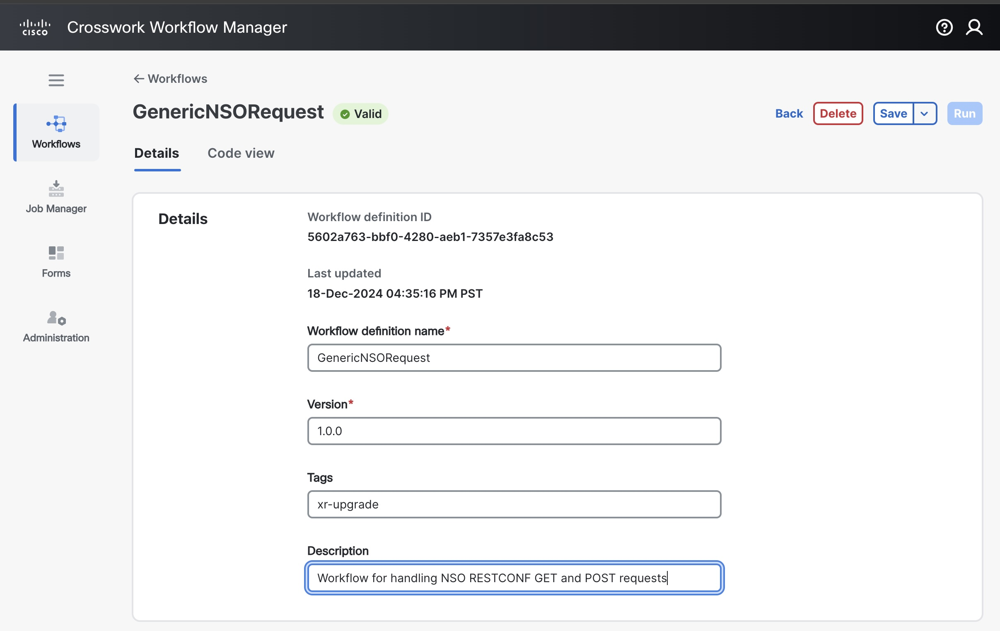
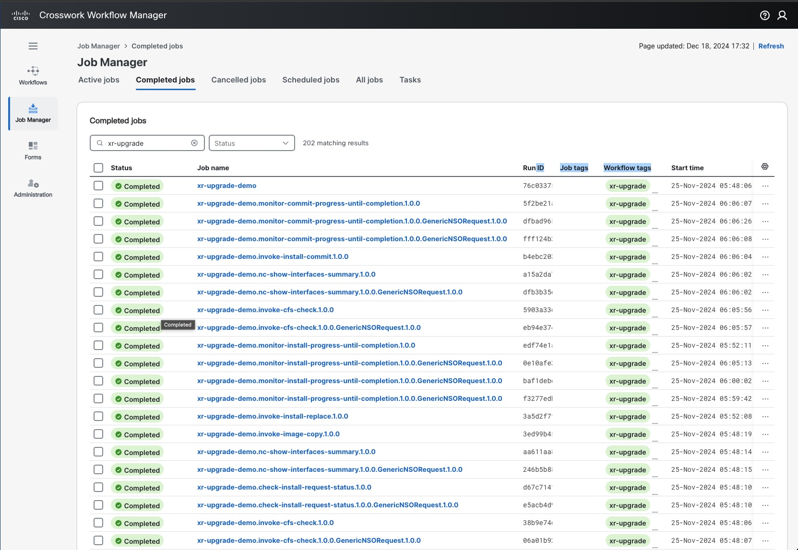

[](https://developer.cisco.com/codeexchange/github/repo/waitai/xr-upgrade-workflows)

# xr-upgrade-workflows
A set of CWM workflows for upgrading a single OS image of the IOS-XR (LNT Flavor) devices.  The CWM workflows interact with NSO via its RESTCONF API and to the device via NSO's IOS-XR NETCONF NED to perform the pre-check, image upgrade and post-check.  The workflows are defined using [CNCF's Serverless Workflow DSL Specification](https://github.com/serverlessworkflow/specification/blob/0.9.x/specification.md) in JSON.


## Table of contents

- [Introduction](#introduction)
- [Prerequisites](#prerequisites)
- [System Setup](#system-setup)
- [Run the XR OS Upgrade Workflows](#run-the-xr-os-upgrade-workflows)

## Introduction

Cisco's [Crosswork Workflow Manager](https://www.cisco.com/c/en/us/products/cloud-systems-management/crosswork-workflow-manager/index.html) (CWM) enables customers to build their own automation workflows, with capabilities to integrate to existing Operations Support Systems (OSS) and Business Support Systems (BSS) within their environment. These integrations are achieved through the use of adapters.

Together with Cisco's [Network Service Orchestrator](https://www.cisco.com/c/en/us/products/collateral/cloud-systems-management/network-services-orchestrator/network-orchestrator-so.html) (NSO), CWM allows ease of automating change management for your network.  It also enables the automation of Router OS upgrade for your network devices.

The xr-upgrade-workflow project demonstrates how a set of child workflows that were developed with assistance from GitHub Copilot was stitched together into a parent workflow (invoke-xr-upgrade) for orchestrating the end-to-end IOS-XR OS image upgrade process including pre-check, upgrade (distribute, activiate, commit), and post-check.

I have presented on "[Using AI to Help Build Workflows in Crosswork Workflow Manager](https://www.youtube.com/watch?v=CCQDw04zjVU)" during the Virtual Automation Developer Days on December 4, 2024.

## Prerequisites
- [**CWM** 1.2 installed using OVA](https://www.cisco.com/c/en/us/td/docs/net_mgmt/cisco_workflow/AdministratorGuide1-2/b_administrator-guide11/m_install-cwm-using-ova_1-1.html)
  - [NSO adapter installed](https://www.cisco.com/c/en/us/td/docs/net_mgmt/cisco_workflow/Operate_1-2/b_cisco-crosswork-workflow-manager-1-1-operator-guide1/m_initial-setup_1-1.html)
- **NSO** install (6.1.9)
  - NETCONF NED for IOS-XR (cisco-iosxr-nc-7.11)
- **IOS-XR** device with NETCONF interface enabled
  - Tested version (7.9.2 LNT)
- [**Workflows Installation**](https://www.cisco.com/c/en/us/td/docs/net_mgmt/cisco_workflow/Operate_1-2/b_cisco-crosswork-workflow-manager-1-1-operator-guide1/m_initial-setup_1-1.html#add-workflow)

## System Setup

Install NSO 6.1.9 

If you are new to NSO, you can start with examples.ncs/getting-started/using-ncs/2-real-device-cisco-ios that comes with the NSO distribution to get started.  Instead of a CLI NED, you would use a NETCONF NED instead.  [Install a NETCONF NED for IOS-XR](https://developer.cisco.com/docs/nso-guides-6.3/administration-guide-nso-packages/#adding-ned-packages) into your NSO server.

Set up the [device authentication](https://developer.cisco.com/docs/nso-guides-6.3/network-element-drivers-and-adding-devices/#device-authentication) and [add your IOS-XR device](https://developer.cisco.com/docs/nso-guides-6.3/network-element-drivers-and-adding-devices/#connecting-devices-for-different-ned-types) into NSO.  The instructions are also described in the README file for the example referred to in the previous paragraph.

The device type and ned id of the IOS-XR device should look as follows:

```
ncs# show running-config devices device xr-1-nc device-type
devices device xr-1-nc
 device-type netconf ned-id cisco-iosxr-nc-7.11
!
```


[Install the NSO adapter into CWM](https://www.cisco.com/c/en/us/td/docs/net_mgmt/cisco_workflow/Operate_1-2/b_cisco-crosswork-workflow-manager-1-1-operator-guide1/m_initial-setup_1-1.html#install-adapter) and [create the secret and resource](https://www.cisco.com/c/en/us/td/docs/net_mgmt/cisco_workflow/Operate_1-2/b_cisco-crosswork-workflow-manager-1-1-operator-guide1/m_initial-setup_1-1.html#create-secrets-and-resources) corresponding to your NSO server. 
 

Clone the repo:

```
git clone https://github.com/waitai/xr-upgrade-workflows.git
```

Go to the workflows folder:

```
cd xr-upgrade-workflows/workflows
```

Update the sourcename in the invoke-image-copy.sw.json file with your own ftp server and user account information to be used as the source of the OS image to be copied from for the upgrade.  For simplicity sake, this information has been hardcoded into the workflow.  

[Install the workflows](https://www.cisco.com/c/en/us/td/docs/net_mgmt/cisco_workflow/Operate_1-2/b_cisco-crosswork-workflow-manager-1-1-operator-guide1/m_initial-setup_1-1.html#add-workflow) from the workflows directory in this github repo and your modified invoke-image-copy workflow onto your CWM server.  The workflows that are being invoked as subflows (or child workflows) need to be installed first.  Start with the GenericNSORequest first, followed by the other subflows, and invoke-xr-upgrade last.

**Add Workflow Procedure**

1. In CWM, go to the Workflows->All Workflows tab.

2. Click on the **Create new workflow** button.


3. In the Create new workflow modal dialog, enter the required input of Workflow definition name to match the name (such as GenericNSORequest) and version (such as 1.0.0) of the workflow file.

4. Click Create Workflow. The steps above create a workflow entry in CWM with dummy code that needs further editing. In the next section, you will insert your workflow definition and replace the pre-defined code.

  

&nbsp;

**Workflow Editing Procedure**

1. To edit an existing workflow, from the **All Workflows tab**, click on the chosen workflow definition name to open the **Details** tab. Fill in the Description field with the information from the workflow file and you can assign the Tags as xr-upgrade.

```
   Note: To add more workflow tags, separate them with a comma.
```



2. Go to the **Code** tab to edit the workflow definition. By default, after creating a new workflow in CWM, the Code tab contains a dummy piece of code that you need to replace with the workflow definition from this repo.


3. After inserting the contents from the workflow file to overwrite the dummy code, click on the **Save** button to save the changes.

&nbsp;

You then repeat the same procedure for the other workflows.  Save the invoke-xr-upgrade.sw.json file till the end.  CWM won't allow the parent workflows to be installed before the child workflows.

## Run the XR OS upgrade workflows

[Select the invoke-xr-upgrade parent level workflow from the Workflows menu in the CWM UI](https://www.cisco.com/c/en/us/td/docs/net_mgmt/cisco_workflow/Operate_1-2/b_cisco-crosswork-workflow-manager-1-1-operator-guide1/m_jobs_1-1.html).  Give it a job name (such as xr-upgrade-demo) and fill in the workflow input data.  An example workflow input data looks like the following:

```json
{
  "deviceName": "xr-1-nc",
  "image": "8000-x64-7.9.2.iso",
  "resourceId": "NSO"
}
```

in which the deviceName is the name of the device as configured in NSO, the image is the name of the image to be upgraded or downgraded from an external ftp server, and resourceId is the resource name of the NSO server that you have configured in the System Setup section above.

After the XR upgrade job has been started, you can go to [CWM's Job Manager](https://www.cisco.com/c/en/us/td/docs/net_mgmt/cisco_workflow/Operate_1-2/b_cisco-crosswork-workflow-manager-1-1-operator-guide1/m_jobs_1-1.html#check-job-status) to check the job status and the job result of each of the workflows.



When you click on the job name of xr-upgrade-demo at the top which corresponds to the parent level workflow of invoke-xr-upgrade, you can inspect the workflow output of the very last workflow event for the job result.


Here's an example of the workflow output in JSON format for a successful run of the invoke-xr-upgrade workflow which is included as part of the last workflow event:

```json
{
  "comparison-interfaces-summary": [
    {
      "admin-down-interface-count": "remained the same",
      "down-interface-count": "remained the same",
      "interface-count": "changed from [null] to [null]",
      "interface-type-name": "IFT_LOOPBACK",
      "up-interface-count": "remained the same"
    },
    {
      "admin-down-interface-count": "remained the same",
      "down-interface-count": "remained the same",
      "interface-count": "changed from [null] to [null]",
      "interface-type-name": "IFT_ETHERNET",
      "up-interface-count": "remained the same"
    },
    {
      "admin-down-interface-count": "remained the same",
      "down-interface-count": "remained the same",
      "interface-count": "changed from [null] to [null]",
      "interface-type-name": "IFT_NULL",
      "up-interface-count": "remained the same"
    },
    {
      "admin-down-interface-count": "remained the same",
      "down-interface-count": "remained the same",
      "interface-count": "changed from [null] to [null]",
      "interface-type-name": "IFT_HUNDREDGE",
      "up-interface-count": "remained the same"
    },
    {
      "admin-down-interface-count": "remained the same",
      "down-interface-count": "remained the same",
      "interface-count": "changed from [null] to [null]",
      "interface-type-name": "IFT_FOURHUNDREDGE",
      "up-interface-count": "remained the same"
    }
  ],
  "comparison-total-interface-counts": {
    "admin-down-interface-count": "remained the same",
    "down-interface-count": "remained the same",
    "interface-count": "remained the same",
    "up-interface-count": "remained the same"
  },
  "postchecksNcShowInterfacesSummaryResult": {
    "output": {
      "Cisco-IOS-XR-pfi-im-cmd-oper:interface-summary": {
        "interface-counts": {
          "admin-down-interface-count": 34,
          "down-interface-count": 0,
          "interface-count": 39,
          "up-interface-count": 5
        },
        "interface-type": [
          {
            "interface-counts": {
              "admin-down-interface-count": 0,
              "down-interface-count": 0,
              "interface-count": 1,
              "up-interface-count": 1
            },
            "interface-type-description": "Loopback interface(s)",
            "interface-type-name": "IFT_LOOPBACK"
          },
          {
            "interface-counts": {
              "admin-down-interface-count": 0,
              "down-interface-count": 0,
              "interface-count": 1,
              "up-interface-count": 1
            },
            "interface-type-description": "Management Ethernet",
            "interface-type-name": "IFT_ETHERNET"
          },
          {
            "interface-counts": {
              "admin-down-interface-count": 0,
              "down-interface-count": 0,
              "interface-count": 1,
              "up-interface-count": 1
            },
            "interface-type-description": "Null interface",
            "interface-type-name": "IFT_NULL"
          },
          {
            "interface-counts": {
              "admin-down-interface-count": 12,
              "down-interface-count": 0,
              "interface-count": 12,
              "up-interface-count": 0
            },
            "interface-type-description": "HundredGigE",
            "interface-type-name": "IFT_HUNDREDGE"
          },
          {
            "interface-counts": {
              "admin-down-interface-count": 22,
              "down-interface-count": 0,
              "interface-count": 24,
              "up-interface-count": 2
            },
            "interface-type-description": "FourHundredGigE",
            "interface-type-name": "IFT_FOURHUNDREDGE"
          }
        ]
      }
    },
    "status": "success"
  },
  "prechecksNcShowInterfacesSummaryResult": {
    "output": {
      "Cisco-IOS-XR-pfi-im-cmd-oper:interface-summary": {
        "interface-counts": {
          "admin-down-interface-count": 34,
          "down-interface-count": 0,
          "interface-count": 39,
          "up-interface-count": 5
        },
        "interface-type": [
          {
            "interface-counts": {
              "admin-down-interface-count": 0,
              "down-interface-count": 0,
              "interface-count": 1,
              "up-interface-count": 1
            },
            "interface-type-description": "Loopback interface(s)",
            "interface-type-name": "IFT_LOOPBACK"
          },
          {
            "interface-counts": {
              "admin-down-interface-count": 0,
              "down-interface-count": 0,
              "interface-count": 1,
              "up-interface-count": 1
            },
            "interface-type-description": "Management Ethernet",
            "interface-type-name": "IFT_ETHERNET"
          },
          {
            "interface-counts": {
              "admin-down-interface-count": 0,
              "down-interface-count": 0,
              "interface-count": 1,
              "up-interface-count": 1
            },
            "interface-type-description": "Null interface",
            "interface-type-name": "IFT_NULL"
          },
          {
            "interface-counts": {
              "admin-down-interface-count": 12,
              "down-interface-count": 0,
              "interface-count": 12,
              "up-interface-count": 0
            },
            "interface-type-description": "HundredGigE",
            "interface-type-name": "IFT_HUNDREDGE"
          },
          {
            "interface-counts": {
              "admin-down-interface-count": 22,
              "down-interface-count": 0,
              "interface-count": 24,
              "up-interface-count": 2
            },
            "interface-type-description": "FourHundredGigE",
            "interface-type-name": "IFT_FOURHUNDREDGE"
          }
        ]
      }
    },
    "status": "success"
  },
  "upgrade-status": "success"
}
```
